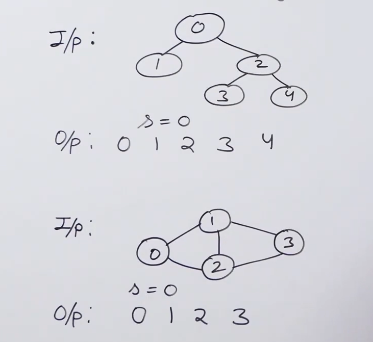

# Breadth First Search (BFS)

BFS stands for Breadth-First Search, which is a graph traversal algorithm that visits all the vertices of a graph in breadth-first order. It starts at a given vertex (called the root or source), explores all the vertices at distance 1 from the root, then all the vertices at distance 2, and so on, until all the vertices have been visited.

BFS uses a queue data structure to keep track of the vertices that need to be visited next. It starts by enqueuing the root vertex, marking it as visited, and then repeatedly dequeuing a vertex, visiting all its unvisited neighbors, marking them as visited, and enqueuing them. This process continues until the queue is empty.

BFS can be used to solve a variety of problems on graphs, such as finding the shortest path between two vertices, checking if a graph is connected or bipartite, and computing the connected components of a graph.

The time complexity of BFS is O(m + n), where m is the number of edges and n is the number of vertices in the graph. The space complexity is also O(m + n), since it requires storing the adjacency list or matrix, the queue, and the visited array.



### Simple Version of BFS:

```java
    static void printfBFS(List<List<Integer>> adj, int s) {
        // declare a visited array, which will track, which vertices are entered into queue.
        boolean[] visited = new boolean[adj.size()];
        // declare a queue, which will be used to traverse the graph in FIFO order.
        Queue<Integer> queue = new LinkedList<>();
        visited[s] = true;
        queue.add(s);
        while(!queue.isEmpty()) {
            int current = queue.poll();
            System.out.print(current+", ");
            for(int v: adj.get(current)) {
                // If the item is not added in queue yet, then add it.
                if(!visited[v]) {
                    visited[v] = true;
                    queue.add(v);
                }
            }
        }
    }
```

### BFS V2(No Source is Given and Graph May be Discontinuous):

```java
static void printBFSDis(List<List<Integer>> adj) {
        // declare a visited array, which will track, which vertices are entered into queue.
        boolean[] visited = new boolean[adj.size()];
        for(int i=0;i<visited.length;i++) {
            if(!visited[i]) {
                printfBFS(adj,i,visited);
            }
        }
}

static void printfBFS(List<List<Integer>> adj, int s, boolean[] visited) {
        // declare a queue, which will be used to traverse the graph in FIFO order.
        Queue<Integer> queue = new LinkedList<>();
        visited[s] = true;
        queue.add(s);
        while(!queue.isEmpty()) {
            int current = queue.poll();
            System.out.print(current+", ");
            for(int v: adj.get(current)) {
                // If the item is not added in queue yet, then add it.
                if(!visited[v]) {
                    visited[v] = true;
                    queue.add(v);
                }
            }
        }
}
```

### Time Complexity of BFS: O(V+E)


### Number of Connected Components in an undirected Graph:

```java
    static void printBFSDis(List<List<Integer>> adj) {
        // declare a visited array, which will track, which vertices are entered into queue.
        boolean[] visited = new boolean[adj.size()];
        int connectedComponents = 0;
        for(int i=0;i<visited.length;i++) {
            if(!visited[i]) {
                printfBFS(adj,i,visited);
                connectedComponents++;
            }
        }

        System.out.println("Connected Components in graph are: "+ connectedComponents);
    }

    static void printfBFS(List<List<Integer>> adj, int s, boolean[] visited) {
        // declare a queue, which will be used to traverse the graph in FIFO order.
        Queue<Integer> queue = new LinkedList<>();
        visited[s] = true;
        queue.add(s);
        while(!queue.isEmpty()) {
            int current = queue.poll();
            System.out.print(current+", ");
            for(int v: adj.get(current)) {
                // If the item is not added in queue yet, then add it.
                if(!visited[v]) {
                    visited[v] = true;
                    queue.add(v);
                }
            }
        }
    }
```
