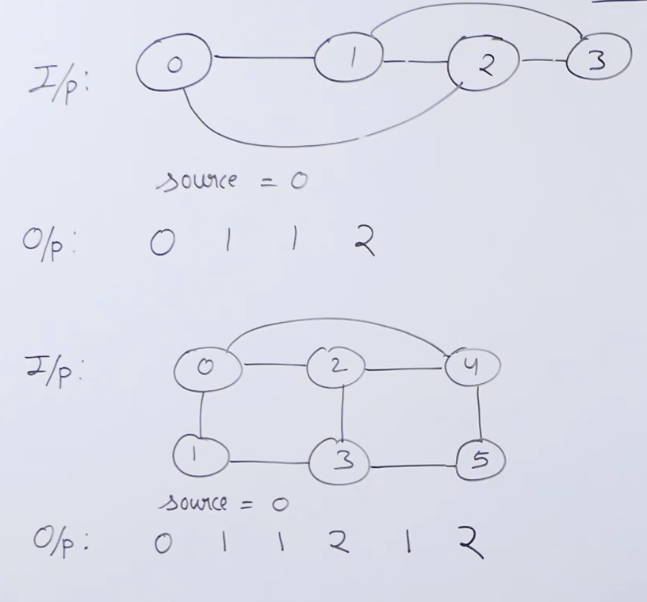

# Depth First Search

```java
import java.util.List;

public class GraphDFS {
    public static void graphDFS(List<List<Integer>> adj, int s, boolean[] visited) {
        visited[s] = true;
        System.out.println(s + " ");
        for(int u: adj.get(s)) {
            if(!visited[s]) {
                graphDFS(adj,u, visited);
            }
        }
    }
}
```

## Applications of DFS:

1. Cycle Detection
2. Topological Sorting
3. Strongly Connected Components
4. Solving Maze and Similar Problomes
5. Path Finding


#### DFS Problomes:

1. Shotest Path in Unweighted Graph



```java
package com.main;

import java.util.Arrays;
import java.util.LinkedList;
import java.util.List;
import java.util.Queue;

public class ShortestPathInGraph {
    public static void findShortestPath(List<List<Integer>> adj, int source) {
        int vertex = adj.size();

        // Initialize a minDist array, which will keep the min distances of vertices from source s.
        int[] minDist = new int[vertex];
        // Fill all the elements of minDist with maximum possible value.
        Arrays.fill(minDist, Integer.MAX_VALUE);
        // Create a boolean array, which will keep track of visited vertices.
        boolean[] visited = new boolean[vertex];
        // Mark the source vertex as visited and keep its distance as 0.
        visited[source] = true;
        minDist[source] = 0;
        
        // Initialize a queue, which will be used to perform BFS Operation.
        Queue<Integer> queue = new LinkedList<>();
        queue.add(source);

        // Iterate over the queue, until no items are left in queue.
        while(! queue.isEmpty()) {
            int u = queue.poll();
            // For Every Adjacent of u.
            for(int v: adj.get(u)) {
                if(!visited[v]) {
                    // Distance of v from s = dist of u from s + 1
                    minDist[v] = minDist[u] + 1;
                    queue.add(v);
                }
            }
        }
        // Print all the distances from the source vertex
        System.out.println(Arrays.toString(minDist));
    }
}
```