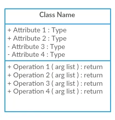
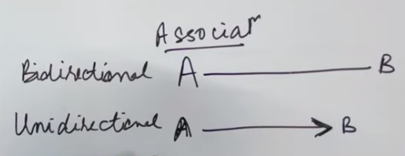
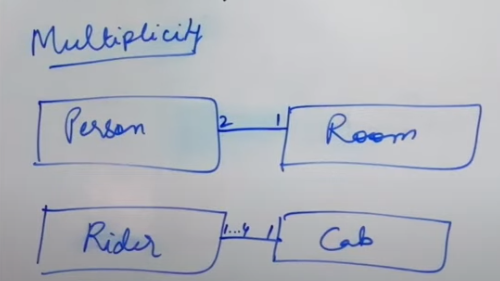

# UML (Unified Modeling Language) Diagrams

UML Diagrams are the pictorial representation of classes, objects, and relationships between them. UML diagrams are models that describes a part of a system.

## Representing a Class in UML Diagram:

A UML Representation of a class have 3 sections:

1. Class Name (At top)
2. Class Attributes/Fields:
    - We can define each attribute and its type like: **name:String**
    - To show the access levels of attributes, we can append + (public), - (private), # (protected) in front of the attributes.
3. Class Methods:
    - We can define each method with its signature like: **covnertUpperCase(String name): String**
    - To Define the visibility of methods, we can use +, - or # in before method name.

To define static attribute/methods, we underline those attributes/methods.

## Relationship Between Classes:

### Association Relationship:

An association can be either uni-directional or bi-directional. If it is bi-direction, it means, Class A can access Class B and Class B can access Class A. In case of unidirection, only one class can access other class.

**Multiplicity** is used to denote the type of relationship between objects.

In above diagram, it can be stated that:
- For one room, there can be 2 persons.
- For one cab, there can be 1 to 4 riders.