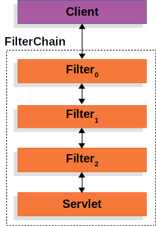
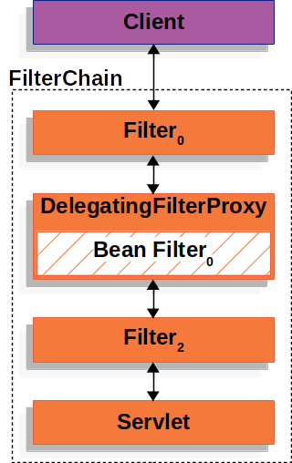
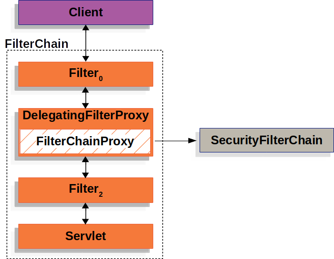
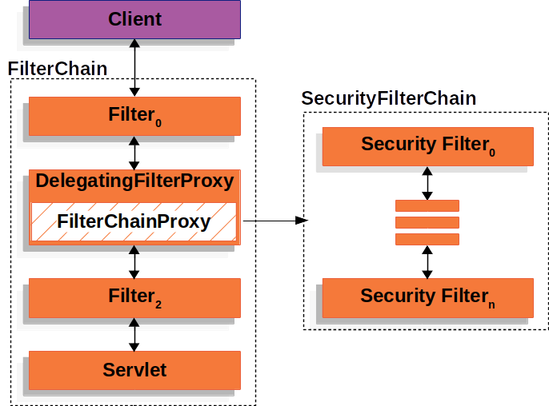
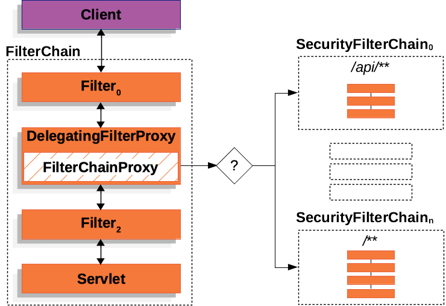

## Architecture and Working of Spring Security

1. Spring security is based upon Servlet Filters.

2. Client sends a request to server and servlet container creates a `FilterChain`, which contains the `Filter` instances and `Servlet` instances, which should process `HttpServletRequest`.

3. Spring provides a `Filter` implementation named `DelegatingFilterProxy` that allows bridging between the Servlet container’s lifecycle and Spring’s `ApplicationContext`.

4. We can register `DelegatingFilterProxy` through the standard Servlet container mechanisms but delegate all the work to a Spring Bean that implements `Filter`.

5. Spring Security's servlet uses `FilterChainProxy`, which is a special `Filter` provided by Spring Security that allows delegating to many Filter instances through `SecurityFilterChain`. Since `FilterChainProxy` is a Bean, it is typically wrapped in a `DelegatingFilterProxy`.

6. `SecurityFilterChain` is used by `FilterChainProxy` to determine which Spring Security `Filter` instances should be invoked for the current request.

7. The Security Filters in `SecurityFilterChain` are typically Beans, but they are registered with `FilterChainProxy` instead of `DelegatingFilterProxy`. `FilterChainProxy` provides a number of advantages to registering directly with the Servlet container or `DelegatingFilterProxy`. 
(i).  It provides a starting point for all of Spring Security’s Servlet support, which makes it easy to troubleshoot and debug.

(ii).  `FilterChainProxy` ensures that the `SecurityContext` is properly initialized and updated based on the user's authentication status. When a request is processed by the filter chain and the response is sent back to the client, it is essential to clear out the `SecurityContext` to avoid potential memory leaks. The `FilterChainProxy` takes care of clearing the `SecurityContext` after processing the request and before sending the response, ensuring that sensitive security-related data is not retained longer than necessary.

8. In the Multiple `SecurityFilterChain` figure, `FilterChainProxy` decides which `SecurityFilterChain` should be used. Only the first `SecurityFilterChain` that matches is invoked.

